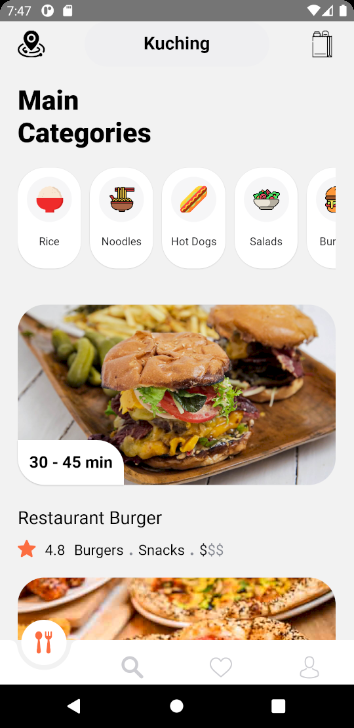

# FoodDeliveryApp
React-native App learn for layouting

Reference from https://www.youtube.com/watch?v=diUDjNwZ8Lg&t=1667s
<table>
  <tr>
    <td></td>
    <td></td>
    <td></td>
  </tr>
 </table>
 
 ## Map using mapbox

- reference from : https://github.com/react-native-mapbox-gl/maps

## Config
please copy file from folder config for set your API Key Mapbox

## ToDo
- make direction route between to point

